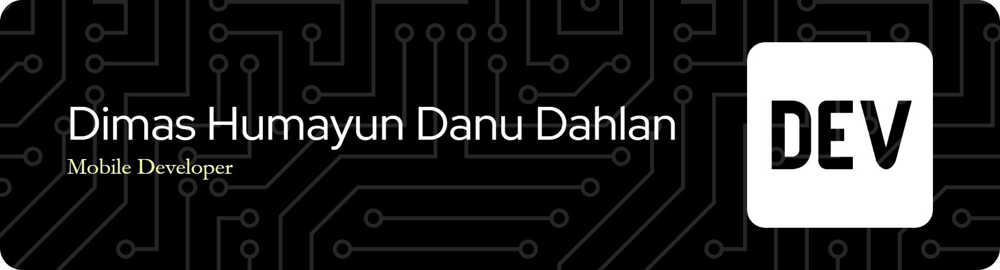

<!-- # Hello World! I'm Dimas Humayun Danu D. :ant: -->
<h1 align="center">Hello World! I am Dimas Humayun Danu D. </h1>
<h3 align="center">A Mobile Developer from indonesia</h3>

<!--  -->
#### About me
- :turtle: I’m currently working on [**SmartFinance**](https://github.com/dhdanudahlan/smartfinance.git)
- :unlock: I’m currently learning [**Flutter**](https://flutter.dev/) for Cross-Platform App Development
- :email: Contact me through <a href="mailto:dhdanudahlan@gmail.com">**dhdanudahlan@gmail.com**</a>

#### Skills
   
<!-- 
 -->

#### My Socials
 
<!-- 

 -->

#### My Stats

&nbsp;&nbsp;

<!--q
- 🔭 I’m currently working on ...
- 👯 I’m looking to collaborate on ...
- 🤔 I’m looking for help with ...
- 💬 Ask me about ...
- 📫 How to reach me: ...
- 😄 Pronouns: ...
- ⚡ Fun fact: ...
-->
